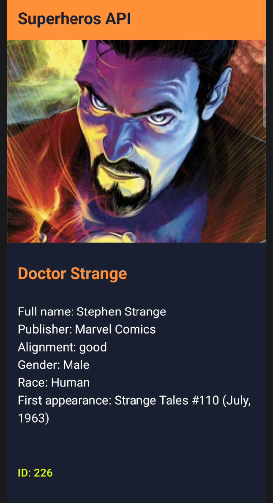
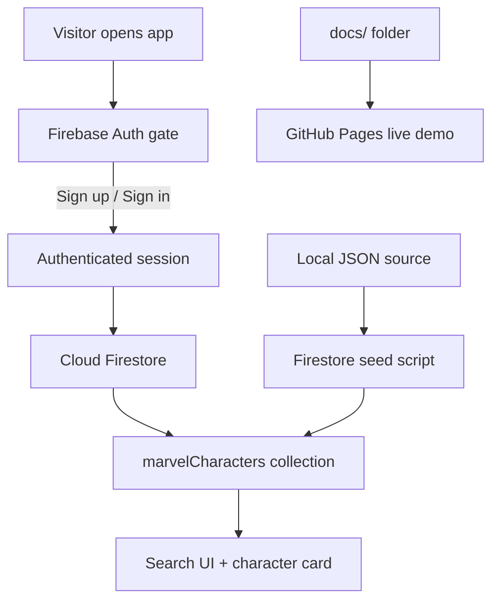

<h1 align="center">MARVEL Comics Explorer</h1>

<p align="center">
  Authenticated Marvel character explorer built with Vanilla JavaScript, Firebase Authentication, Cloud Firestore, and GitHub Pages.
</p>

<p align="center">
  <a href="https://anis151993.github.io/Marvel-Comics-API/">
    
  </a>
  
  
  
  
</p>

<p align="center">
  <a href="#live-demo">Live Demo</a> •
  <a href="#highlights">Highlights</a> •
  <a href="#architecture">Architecture</a> •
  <a href="#quick-start">Quick Start</a> •
  <a href="#firebase-setup">Firebase Setup</a> •
  <a href="#deployment">Deployment</a> •
  <a href="#project-structure">Project Structure</a>
</p>

<p align="center">
  
</p>

## Live Demo

**Production URL:**  
https://anis151993.github.io/Marvel-Comics-API/

This live version is deployed from the `docs/` folder and uses:

- Firebase Authentication for sign-up and sign-in
- Cloud Firestore for Marvel character data
- GitHub Pages for static hosting

## Highlights

| Feature | What it does |
| --- | --- |
| Auth Gate | Users must create an account or sign in before entering the app |
| Firestore Data | Character records load from the `marvelCharacters` collection |
| Search UX | Fast autocomplete with browse mode and exact card lookup |
| Character Cards | Rich card layout with image, metadata, and alignment badge |
| Image Download | Users can download a character image from the card |
| Static Deployment | Works on GitHub Pages without a custom backend |

> [!IMPORTANT]
> This is a Firebase-first static app. The active runtime stack is Firebase Authentication + Cloud Firestore + GitHub Pages. Legacy MongoDB and Express folders are not part of the live user flow.

## Architecture



## Quick Start

```bash
npm install
npm run dev
```

Then complete the Firebase setup below, seed Firestore, and open:

```text
http://localhost:3000/
```

## Firebase Setup

This project uses two Firebase services:

- Firebase Authentication
- Cloud Firestore

<details>
<summary><strong>Step 1: Create the Firebase project</strong></summary>

1. Open the Firebase Console.
2. Create a new Firebase project.
3. Add a **Web App** inside the project.
4. Copy the Firebase web config values.
5. Paste them into:
   - `js/firebase-config.js`
   - `docs/firebase-config.js`

</details>

<details>
<summary><strong>Step 2: Enable Email/Password Authentication</strong></summary>

1. Go to `Firebase Console -> Authentication -> Sign-in method`.
2. Enable `Email/Password`.
3. Run the local app:

```bash
npm run dev
```

4. Open the app and create your first account.

</details>

<details>
<summary><strong>Step 3: Create Cloud Firestore</strong></summary>

1. Go to `Firebase Console -> Build -> Firestore Database`.
2. Click `Create database`.
3. Choose `Production mode`.
4. Select your Firebase region.

</details>

<details>
<summary><strong>Step 4: Publish Firestore rules</strong></summary>

Open `Firebase Console -> Build -> Firestore Database -> Rules` and publish the rules from `firestore.rules`:

```txt
rules_version = '2';

service cloud.firestore {
  match /databases/{database}/documents {
    match /marvelCharacters/{characterId} {
      allow read: if request.auth != null;
      allow write: if false;
    }
  }
}
```

These rules:

- allow signed-in users to read character data
- block direct browser writes
- keep database writes controlled through admin tooling

</details>

<details>
<summary><strong>Step 5: Generate a Firebase Admin private key</strong></summary>

1. Go to `Firebase Console -> Project settings -> Service accounts`.
2. Click `Generate new private key`.
3. Save the downloaded JSON file in the repo root.

Example:

```text
./your-firebase-adminsdk.json
```

This file is private and must never be committed to GitHub.

</details>

<details>
<summary><strong>Step 6: Seed Firestore with Marvel characters</strong></summary>

Run:

```bash
npm run seed:firestore -- --service-account ./your-firebase-adminsdk.json --delete-first
```

What this does:

- reads the local JSON dataset
- uploads it into Firestore
- writes to the `marvelCharacters` collection
- replaces the collection first when `--delete-first` is used

Optional flags:

- `--input ./some-file.json`
- `--collection someCollectionName`
- `--delete-first`

</details>

<details>
<summary><strong>Step 7: Use the app</strong></summary>

1. Keep `npm run dev` running.
2. Open `http://localhost:3000/`.
3. Sign in with your Firebase account.
4. Search for a character such as `Iron Man`.
5. Confirm that the app loads records from Firestore.

</details>

## Daily Workflow

### Run locally

```bash
npm install
npm run dev
```

### Build before finishing changes

```bash
npm run build
```

### Refresh the source dataset

```bash
npm run pull:marvel
```

### Reseed Firestore after refreshing data

```bash
npm run seed:firestore -- --service-account ./your-firebase-adminsdk.json --delete-first
```

## Deployment

GitHub Pages serves this project from the `docs/` folder on the `main` branch.

### Deployment flow

1. Update the root app files.
2. Mirror the same user-facing changes into `docs/`.
3. Run:

```bash
npm run build
```

4. Commit your changes.
5. Push to `origin main`.
6. Wait for GitHub Pages to redeploy.

> [!NOTE]
> The live demo may take a short time to reflect new changes after pushing.

## Important Notes

- Firebase web config values are safe to keep in frontend code.
- Firebase Admin service account keys are **not** safe to expose.
- The browser app reads Firestore only after auth state is confirmed.
- `docs/` must stay aligned with the root app for GitHub Pages.
- `characters-server/` and `mongodb/` are legacy paths, not the active production flow.

## Troubleshooting

<details>
<summary><strong>Firestore rules show a parse error</strong></summary>

Make sure you are editing:

`Firebase Console -> Build -> Firestore Database -> Rules`

Do **not** paste Firestore rules into `Realtime Database -> Rules`, because that editor expects JSON.

</details>

<details>
<summary><strong>The app says Firestore is empty</strong></summary>

Seed the collection:

```bash
npm run seed:firestore -- --service-account ./your-firebase-adminsdk.json --delete-first
```

</details>

<details>
<summary><strong>The live site still shows the old version after push</strong></summary>

GitHub Pages can take a little time to update. Wait briefly, then refresh again. A hard refresh may also help.

</details>

## Project Structure

```text
Marvel-Comics-API/
├── AGENT.md                    # Repo-specific Codex guidance
├── docs/                       # GitHub Pages live site copy
├── public/                     # Root JSON source for Firestore seeding
├── css/                        # Root styling
├── js/                         # Root frontend logic
├── scripts/                    # Data pull + Firestore seed automation
├── firestore.rules             # Firestore security rules
├── Demo_output/                # Preview assets
├── marvel-json/                # Alternate local variant
├── marvel-generator/           # Legacy source / API helper files
├── characters-server/          # Legacy Express backend
└── mongodb/                    # Legacy MongoDB utilities
```

## Core Files

- `index.html`
- `css/style.css`
- `js/script.js`
- `js/firebase-config.js`
- `docs/index.html`
- `docs/style.css`
- `docs/script.js`
- `docs/firebase-config.js`
- `scripts/seed-firestore.mjs`
- `scripts/pull-marvel-characters.mjs`
- `firestore.rules`
- `AGENT.md`

## Tech Stack

- Vanilla JavaScript
- HTML5
- CSS3
- Vite
- Firebase Authentication
- Cloud Firestore
- GitHub Pages

## Final Checklist

- Firebase project created
- Email/Password auth enabled
- Cloud Firestore created
- Firestore rules published
- Service account downloaded locally
- Firestore seeded with character data
- `npm run build` passes
- `docs/` copy matches the root app
- GitHub Pages live demo updated
